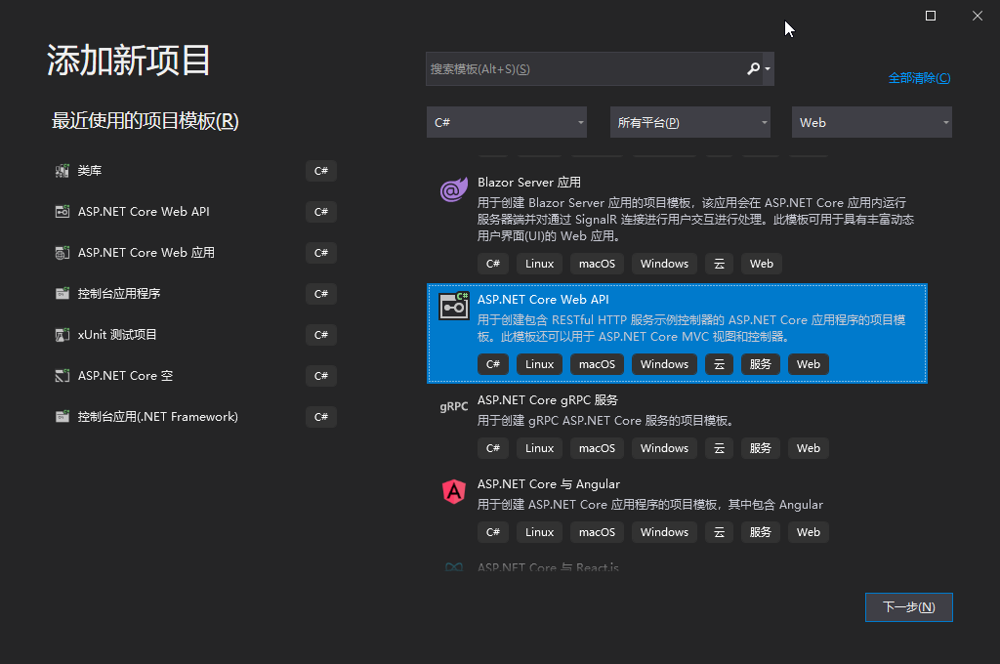
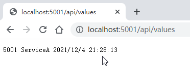
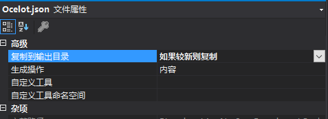
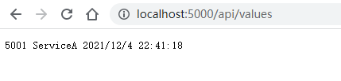
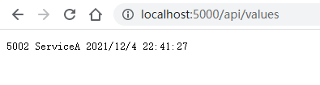

[toc]
#
## 相关环境说明

> Windows 10  
> [Visual Studio 2019](https://docs.microsoft.com/zh-cn/visualstudio/releases/2019/release-notes)  
> [.NET Core 3.1](https://dotnet.microsoft.com/download/dotnet)   


## 建立WebApi项目
1. 新建一个.NetCore的WebApi项目 Antc.ApiServiceA（作为具体提供服务的接口程序）  
  

2. 在Controller中添加类 ValuesController.cs ,内容如下
```csharp
using System;
using Microsoft.AspNetCore.Mvc;
using Microsoft.Extensions.Configuration;

namespace Antc.ApiServiceA.Controllers
{
    [Route("api/[controller]")]
    [ApiController]
    public class ValuesController : ControllerBase
    {
        public IConfiguration _configuration { get; }
        public ValuesController(IConfiguration configuration)
        {
            this._configuration = configuration;
        }

        [HttpGet]
        public string Get()
        {
            return HttpContext.Request.Host.Port + " " + _configuration["AppName"] + " " + DateTime.Now.ToString();
        }
    }
}
```

3. 修改 appsettings.json
```json
{
  "Logging": {
    "LogLevel": {
      "Default": "Information",
      "Microsoft": "Warning",
      "Microsoft.Hosting.Lifetime": "Information"
    }
  },
  "AllowedHosts": "*",
  "AppName": "ServiceA" //添加此行
}
```


4. 修改项目的 launchSettings.json
```json
{
  "iisSettings": {
    "windowsAuthentication": false,
    "anonymousAuthentication": true,
    "iisExpress": {
      "applicationUrl": "http://localhost:5001", // 修改
      "sslPort": 0 //修改
    }
  },
  "$schema": "http://json.schemastore.org/launchsettings.json",
  "profiles": {
    "IIS Express": {
      "commandName": "IISExpress",
      "launchBrowser": true,
      "launchUrl": "weatherforecast",
      "environmentVariables": {
        "ASPNETCORE_ENVIRONMENT": "Development"
      }
    },
    "Antc.ApiServiceA": {
      "commandName": "Project",
      "launchBrowser": true,
      "launchUrl": "weatherforecast",
      "environmentVariables": {
        "ASPNETCORE_ENVIRONMENT": "Development"
      },
      "applicationUrl": "http://localhost:5001" //修改
    }
  }
}
```

4. <kbd>F5</kbd>启动项目 Antc.ApiServiceA，然后在浏览器中打开地址 http://localhost:5001/api/values 



## Ocelot网关搭建

1. 新建一个.NetCore的WebApi项目 Antc.ApiGateway  


2. 安装Nuget依赖
> 需要安装的Nuget包  
> Ocelot 15.0.7  
> 打开 视图 > 其他窗口 > 程序包管理控制台  
> 输入以下命令进行安装安装
```
Install-Package Ocelot -Version 15.0.7
```

3. 新建 Ocelot.json，打开文件属性窗口，将复制到输出目录调整为“如果较新则复制”


调整Ocelot.json内容，如下所示
```json
{
  "ReRoutes": [
    {
      "UpstreamPathTemplate": "/api/{everything}",
      "UpstreamHttpMethod": [ "Get" ],
      "DownstreamPathTemplate": "/api/{everything}",
      "DownstreamScheme": "http",
      "DownstreamHostAndPorts": [
        {
          "host": "localhost",
          "port": 5001
        },
        {
          "host": "localhost",
          "port": 5002
        }
      ],
      "LoadBalancerOptions": {
        "Type": "LeastConnection"
      }
    }
  ],
  "GlobalConfiguration": {
    "BaseUrl": "http://localhost:5000",
  }
}
```

## 启动项目
### 启动WebApi项目

发布Antc.ApiServiceA后 开启两个CMD窗口分别启动
```
dotnet Antc.ApiServiceA.dll --urls="http://localhost:5001"

dotnet Antc.ApiServiceA.dll --urls="http://localhost:5002"
```
到这里相当于5001和5002程序简单集群了一下

### 启动

<kbd>F5</kbd>启动项目Antc.ApiGatewa运行，并打开浏览器访问 http://localhost:5000/api/values ,并刷新多次，会发现结果返回不一样，这就是经过了网关将请求发到两个服务上面去了


  


Ocelot网关的更多相关信息 请到官网查阅 https://threemammals.com/ocelot